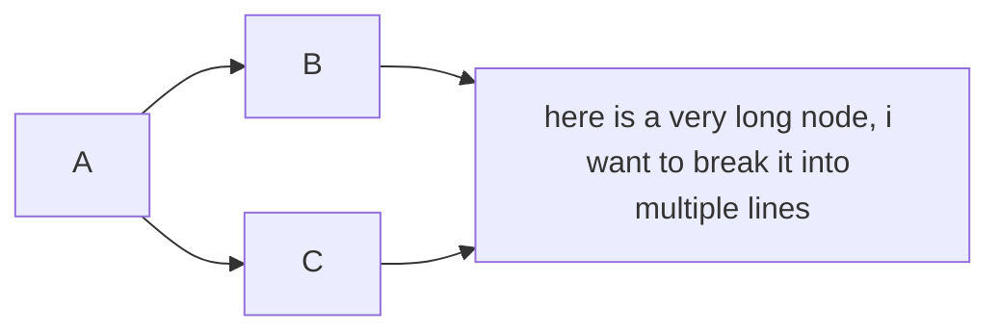

<!-- example Markdown file -->

<!-- css style -->
<link rel="stylesheet" href="style.css">

<!-- render math to pdf -->
<script src="https://polyfill.io/v3/polyfill.min.js?features=es6"></script>
<script id="MathJax-script" async src="https://cdn.jsdelivr.net/npm/mathjax@3/es5/tex-mml-chtml.js"></script>
<script>
window.MathJax = {
  tex: {
    inlineMath: [['$', '$']],
    processEscapes: true,
    displayMath: [['$$', '$$']]
  }
};
</script>

<!--  -->

<!-- Document start -->

# This is a level 1 heading

## This is a level 2 heading

### This is a level 3 heading

#### This is a level 4 heading

##### This is a level 5 heading

###### This is a level 6 heading

This is a paragraph of text. Here's a [link](https://www.youtube.com/) to an external website.

Here's an unordered list:
- Item 1
- Item 2
- Item 3
  - Subitem 1
  - Subitem 2


Here's an ordered list:
1. First item
2. Second item
3. Third item
    1. Subitem 1
    2. Subitem 2

> This is a blockquote. It can span multiple lines.
>
> Here's a second paragraph in the blockquote.

<v>
This is a verse block.
</v>

<div class="definition">
    Here's a definition
</div>

<div class="note">
    Here's a note
</div>

<div class="warning">
    Here's a warning
</div>

<div class="tip">
    Here's a tip
</div>

<div class="important">
    Here's something important
</div>

<div class="error">
    Here's an error
</div>

<div class="success">
    Here's a success
</div>

<div class="remarque">
    Here's a 'remarque'
</div>

<div class="exemple">
    Here's an 'exemple'
</div>

Here are my custom color or highlight elements : 

<red>
This is a red text
</red>

<green>
This is a green text
</green>

<blue>
This is a blue text
</blue>

<yellow>
This is a yellow text
</yellow>

<orange>
This is an orange text
</orange>

<purple>
This is a purple text
</purple>

<pink>
This is a pink text
</pink>

<grey>
This is a grey text
</grey>

<hred>
This is a red highlight
</hred>

<hgreen>
This is a green highlight
</hgreen>

<hblue>
This is a blue highlight
</hblue>

<hyellow>
This is a yellow highlight
</hyellow>

<horange>
This is an orange highlight
</horange>

<hpurple>
This is a purple highlight
</hpurple>

<hpink>
This is a pink highlight
</hpink>

<hgrey>
This is a grey highlight
</hgrey>

Here's some inline code: `console.log('Hello, world!');`

Here's a code block:

```javascript
function add(a, b) {
  return a + b;
}
```

Here's an image:


Here's some **bold** text and some *italic* text.

Here's a table:

| Column 1 | Column 2 |
| -------- | -------- |
| Item 1   | Item 2   |
| Item 3   | Item 4   |

Here's a horizontal rule:

---

Here's a footnote[^1].

[^1]: This is a footnote.

Here's a definition list:

Term 1 
: Definition 1

Term 2
: Definition 2

Here's a task list:

- [x] Task 1
- [ ] Task 2
- [ ] Task 3
- [X] Task 4

Here's an abbreviation: HTML

Here's a math block:

$$
\frac{1}{n^{2}}
$$


Here's a math inline: $\frac{1}{n^{2}}$

Here's a superscript: 10<sup>2</sup>

Here's a subscript: H<sub>2</sub>O

Here's a strikethrough: ~~strikethrough~~

Here's a comment: <!-- This is a comment -->

Here's some emoji: 🐻

This is a mermaid diagram:


