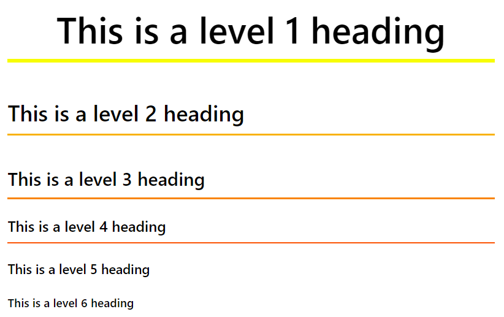
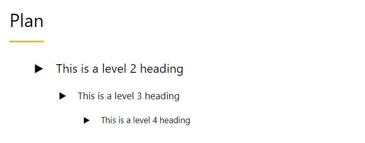
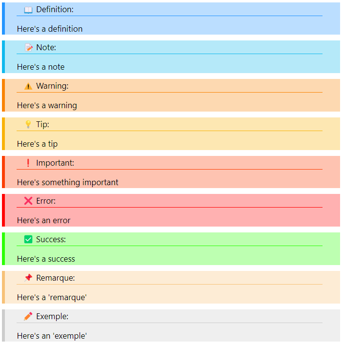
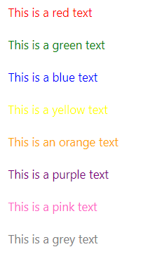
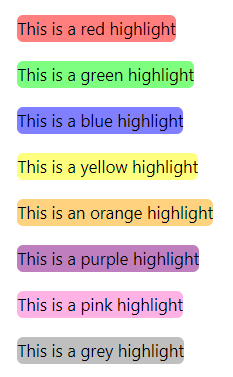
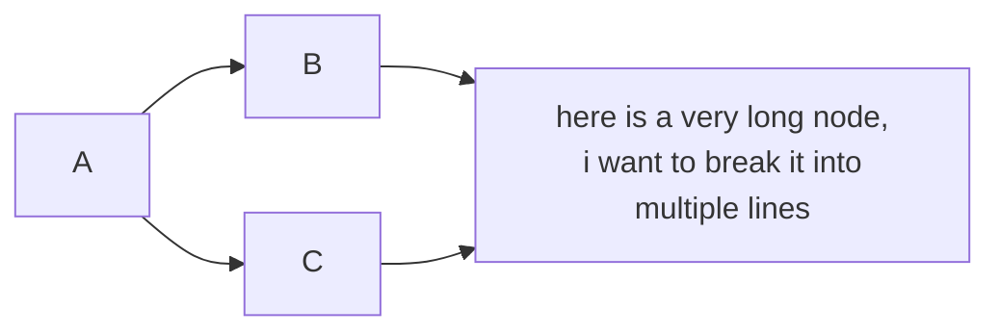
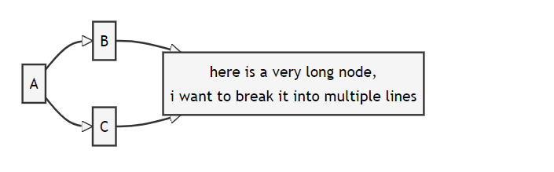
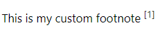
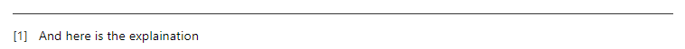

# Markdown-Themes

## Introduction

This repository contains a collection of themes for the Markdown editor and allows you to create some beautiful documents.

## Available Themes

- ALXS-white
- Aesthetic

(the other themes are just in development)

## Installation

### Install Locally

Get the `import.js`, `style.css`  files and the `javascript` folder from the theme you want to use and put them in the same folder as your markdown file.

Then add the following line to the top of your markdown file:

```md
<script src="import.js"></script>
```

### CDN

Add the following line to the top of your markdown file:

```md
<script src="https://cdn.jsdelivr.net/gh/ALXS-GitHub/Markdown-Themes@latest/<THEME>/cdnimport.js"></script>
```

for example with the ALXS-white theme:

```md
<script src="https://cdn.jsdelivr.net/gh/ALXS-GitHub/Markdown-Themes@latest/ALXS-white/cdnimport.js"></script>
```

## Usage

(Based on the ALXS-white theme)

The themes provide a set of custom elements that you can use in your markdown file.

### Colors

#### Aesthetic

You can use the following script to change the main color of the theme:

```html
<script defer>
	window.addEventListener("load", function() {
        document.color.setColor(yellow);
      });
</script>
```

where `color` is a variable that contains the color you want to use.

For the moment, the available colors are:
- `blue` (default)
- `yellow`
- `pink`

### Titles

You can use title with the usual markdown syntax:

```md
# This is a level 1 heading
## This is a level 2 heading
### This is a level 3 heading
#### This is a level 4 heading
##### This is a level 5 heading
###### This is a level 6 heading
```



### Plan

You can use the `<plan></plan>` element to automatically generate a table of contents for `h2`, `h3` and `h4` titles.

```md
<plan></plan>
```



### Custom Blocks

You can make multiple types of custom blocks using these classes on a `<div>` element:

- `definition`
- `note`
- `warning`
- `tip`
- `important`
- `error`
- `success`
- `remarque` (french for note)
- `exemple` (french for example)



### Custom Colors

You can use the following tags to change the color of the text:

- `<red></red>`
- `<green></green>`
- `<blue></blue>`
- `<yellow></yellow>`
- `<orange></orange>`
- `<purple></purple>`
- `<pink></pink>`
- `<gray></gray>`



### Custom Highlight

You can use the following tags to highlight the text:

- `<hred></hred>`
- `<hgreen></hgreen>`
- `<hblue></hblue>`
- `<hyellow></hyellow>`
- `<horange></horange>`
- `<hpurple></hpurple>`
- `<hpink></hpink>`
- `<hgray></hgray>`



### Mermaid

You can use the usual markdown syntax for mermaid diagrams:

```md




### Footnotes

You can use the following syntax to make footnotes:

```md
This is my <fnote>custom footnote || And here is the explaination</fnote>
```



This will automatically generate a table of footnotes at the end of the document.




### Other

All the other markdown syntax and elements are supported.

## Author

- [ALXS-GitHub](https://github.com/ALXS-GitHub)
