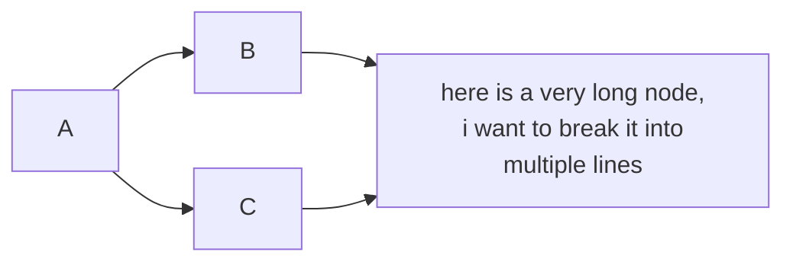
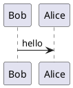
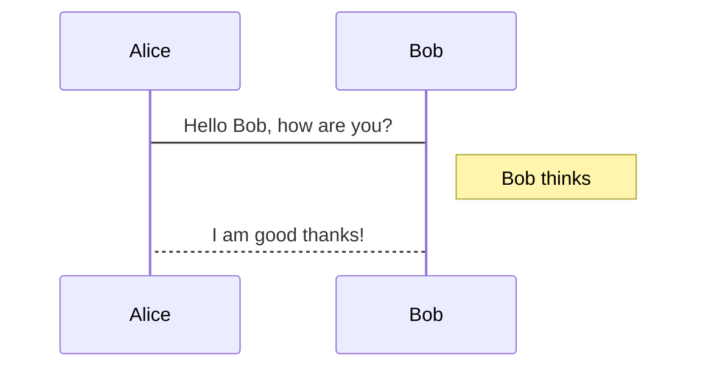

<!-- example Markdown file -->

<!-- css style -->

<script src="import.js" defer></script>

<!--  --

<!-- Document start -->

# This is a level 1 heading

<plan></plan>

## This is a level 2 heading

### This is a level 3 heading

#### This is a level 4 heading

##### This is a level 5 heading

###### This is a level 6 heading

This is a paragraph of text. Here's a [link](https://www.youtube.com/) to an external website.

Here's an unordered list:
- Item 1
- Item 2
- Item 3
  - Subitem 1
  - Subitem 2


Here's an ordered list:
1. First item
2. Second item
3. Third item
    1. Subitem 1
    2. Subitem 2

> This is a blockquote. It can span multiple lines.
>
> Here's a second paragraph in the blockquote.

<v>
This is a verse block.
</v>

<div class="definition">
    Here's a definition
</div>

<div class="note">
    Here's a note
</div>

<div class="warning">
    Here's a warning
</div>

<div class="tip">
    Here's a tip
</div>

<div class="important">
    Here's something important
</div>

<div class="error"> 
    Here's an error
</div>

<div class="success">
    Here's a success
</div>

<div class="abstract">
    Here's an abstract
</div>

<div class="example">
    Here's an example
</div>

<div class="question">
    Here's a question
</div>

<div class="quote">
    Here's a quote
</div>

<div class="bug">
    Here's an bug
</div>

Here are my custom color or highlight elements : 

<red>This is a red text</red>

<green>This is a green text</green>

<blue>This is a blue text</blue>

<yellow>This is a yellow text</yellow>

<orange>This is an orange text</orange>

<purple>This is a purple text</purple>

<pink>This is a pink text</pink>

<grey>This is a grey text</grey>

<hred>This is a red highlight</hred>

<hgreen>This is a green highlight</hgreen>

<hblue>This is a blue highlight</hblue>

<hyellow>This is a yellow highlight</hyellow>

<horange>This is an orange highlight</horange>

<hpurple>This is a purple highlight</hpurple>

<hpink>This is a pink highlight</hpink>

<hgrey>This is a grey highlight</hgrey>

Here's some inline code: `console.log('Hello, world!');`

Here's a code block:

```javascript
function add(a, b) {
  return a + b;
}
```

Here's an image:


Here's some **bold** text and some *italic* text.

Here's a table:

| Column 1 | Column 2 |
| -------- | -------- |
| Item 1   | Item 2   |
| Item 3   | Item 4   |

Here's a horizontal rule:

---

Here's a footnote[^1].

[^1]: This is a footnote.

This is my <fnote>custom footnote || And here is the explaination</fnote>

Here is a <fnote>second custom footnote || And here is the explaination of the second one</fnote>

Here's a definition list:

Term 1 
: Definition 1

Term 2
: Definition 2

Here's a task list:

- [x] Task 1
- [ ] Task 2
- [ ] Task 3
- [X] Task 4

Here's an abbreviation: HTML

Here's a math block:

$$
\frac{1}{n^{2}}
$$


Here's a math inline: $\frac{1}{n^{2}}$

Here's a superscript: 10<sup>2</sup>

Here's a bit more math : 

$\overrightarrow{AF} = \begin{pmatrix} 0 \\ \frac{1}{2} \end{pmatrix} - \begin{pmatrix} 1 \\ 0 \end{pmatrix} = \begin{pmatrix} -1 \\ \frac{1}{2} \end{pmatrix}$

$\overrightarrow{EG} = \begin{pmatrix} 0 \\ \frac{1}{4} \end{pmatrix} - \begin{pmatrix} \frac{1}{2} \\ 0 \end{pmatrix} = \begin{pmatrix} -\frac{1}{2} \\ \frac{1}{4} \end{pmatrix}$

$x = \frac{4 \pm \sqrt{64}}{2} = 2 \pm 4$

Here's a subscript: H<sub>2</sub>O

Here's a strikethrough: ~~strikethrough~~

Here's a comment: <!-- This is a comment -->

Here's some emoji: 🐻

This is a mermaid diagram:



Here's a plantuml diagram:



Here's a sequence diagram:



```bash
This is going to be a very long line of code, in order to see if the overflow persists or not (especially when we convert this file to pdf).
Here is a second line.
```
