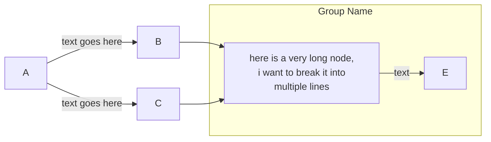
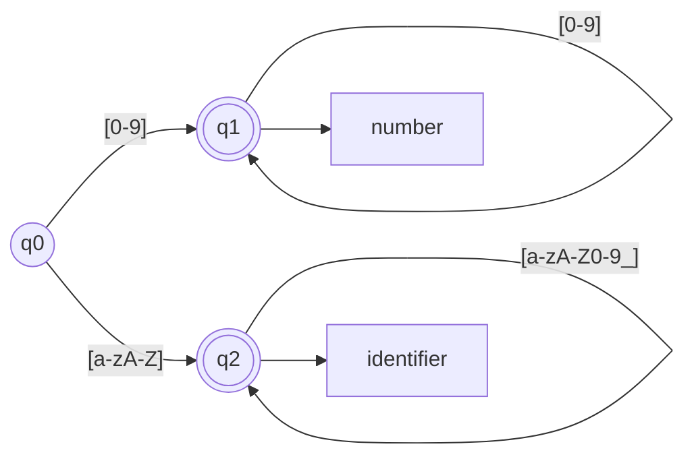
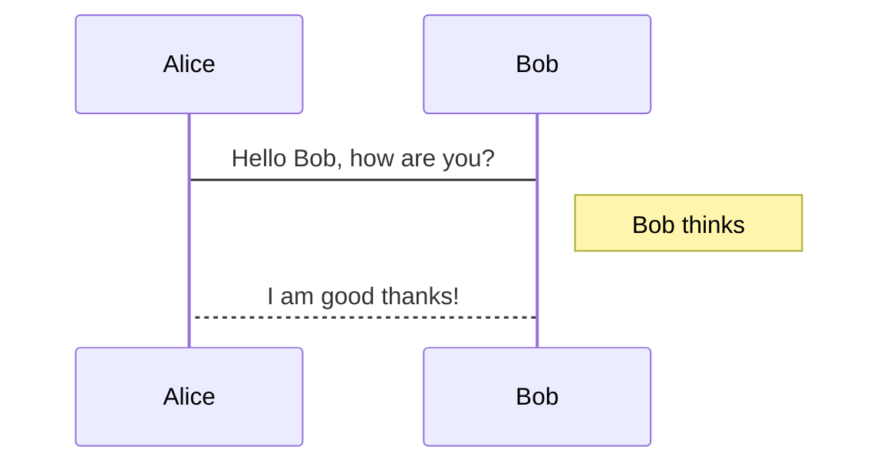
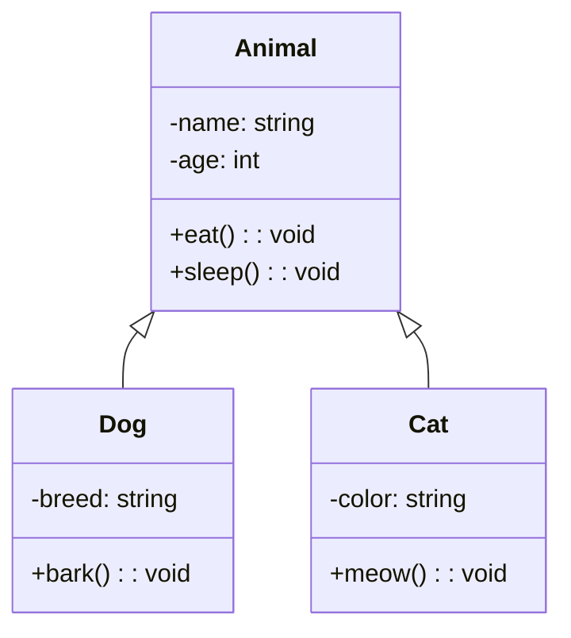
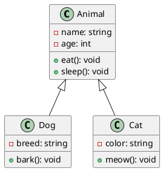

<!-- example Markdown file -->

<!-- css style -->

<script src="import.js" defer></script>
<script src="https://cdn.jsdelivr.net/npm/katex@0.13.18/dist/katex.min.js" defer></script>
<link rel="stylesheet" href="https://cdn.jsdelivr.net/npm/katex@0.13.18/dist/katex.min.css">
<!-- <script defer>
	window.addEventListener("load", function() {
        document.color.setColor("red");
      });
</script> -->
<script defer>
  window.addEventListener("load", function() {
        document.font.setBodyFont("arial");
      });
</script>

<!-- Document start -->

# This is a level 1 heading

<author>ALXS</author>

<date></date>

<plan></plan>

## This is a level 2 heading

### This is a level 3 heading

#### This is a level 4 heading

##### This is a level 5 heading

###### This is a level 6 heading

This is a paragraph of text. Here's a [link](https://www.youtube.com/) to an external website.

Here's an unordered list:

-   Item 1
-   Item 2
-   Item 3
    -   Subitem 1
    -   Subitem 2

Here's an ordered list:

1. First item
2. Second item
3. Third item
    1. Subitem 1
    2. Subitem 2

> This is a blockquote. It can span multiple lines.
>
> Here's a second paragraph in the blockquote.

<v>
This is a verse block.
</v>

<div class="definition">
    Here's a definition
</div>

<div class="note">
    Here's a note
</div>

<div class="warning">
    Here's a warning
</div>

<div class="tip">
    Here's a tip
</div>

<div class="important">
    Here's something important
</div>

<div class="error"> 
    Here's an error
</div>

<div class="success">
    Here's a success
</div>

<div class="abstract">
    Here's an abstract
</div>

<div class="example">
    Here's an example
</div>

<div class="question">
    Here's a question
</div>

<div class="quote">
    Here's a quote
</div>

<div class="bug">
    Here's an bug
</div>

<pagebreak></pagebreak>

Here are my custom color or highlight elements :

<red>This is a red text</red>

<green>This is a green text</green>

<blue>This is a blue text</blue>

<yellow>This is a yellow text</yellow>

<orange>This is an orange text</orange>

<purple>This is a purple text</purple>

<pink>This is a pink text</pink>

<grey>This is a grey text</grey>

<hred>This is a red highlight</hred>

<hgreen>This is a green highlight</hgreen>

<hblue>This is a blue highlight</hblue>

<hyellow>This is a yellow highlight</hyellow>

<horange>This is an orange highlight</horange>

<hpurple>This is a purple highlight</hpurple>

<hpink>This is a pink highlight</hpink>

<hgrey>This is a grey highlight</hgrey>

Here's some inline code: `console.log('Hello, world!');`

Here's a code block:

```javascript
function add(a, b) {
    a = a + 1;
    b = 2 + 1 + 2;
    return a + b;
}
```

Here's an image:


Here's some **bold** text and some _italic_ text.

Here's a table:

| Column 1 | Column 2 |
| -------- | -------- |
| Item 1   | Item 2   |
| Item 3   | Item 4   |

Here's a horizontal rule:

---

Here's a footnote[^1].

[^1]: This is a footnote.

This is my <fnote>custom footnote || And here is the explaination</fnote>

Here is a <fnote>second custom footnote || And here is the explaination of the second one</fnote>

Here's a definition list:

Term 1
: Definition 1

Term 2
: Definition 2

Here's a task list:

-   [x] Task 1
-   [ ] Task 2
-   [ ] Task 3
-   [x] Task 4

Here's an abbreviation: HTML

Here's a math block:


$$
\frac{1}{n^{2}}
$$


Here's a math inline: $\frac{1}{n^{2}}$

Here's a superscript: 10<sup>2</sup>

Here's a bit more math :

$\overrightarrow{AF} = \begin{pmatrix} 0 \\ \frac{1}{2} \end{pmatrix} - \begin{pmatrix} 1 \\ 0 \end{pmatrix} = \begin{pmatrix} -1 \\ \frac{1}{2} \end{pmatrix}$

$\overrightarrow{EG} = \begin{pmatrix} 0 \\ \frac{1}{4} \end{pmatrix} - \begin{pmatrix} \frac{1}{2} \\ 0 \end{pmatrix} = \begin{pmatrix} -\frac{1}{2} \\ \frac{1}{4} \end{pmatrix}$

$\left(\begin{bmatrix} 1 \\ 3 \end{bmatrix} - \begin{bmatrix} 2 \cr 2 \end{bmatrix} \right) \cdot \begin{bmatrix} 4 \cr 4 \end{bmatrix}  =0$

$x = \frac{4 \pm \sqrt{64}}{2} = 2 \pm 4$

$\begin{aligned} 2x + 3y &= 4 \\ 3x + 4y + 0 - 0 &= 5 \end{aligned}$

\begin{equation}
\begin{aligned}
2x + 3y &= 4 \\
3x + 4y &= 5
\end{aligned}
\end{equation}

$$
\begin{aligned}
2x + 3y &= 4 \\
3x + 4y &= 5
\end{aligned}
$$

This is a first line
This is a second line


Here's a subscript: H<sub>2</sub>O

Here's a strikethrough: ~~strikethrough~~

Here's a comment: <!-- This is a comment -->

Here's some emoji: 🐻

This is a mermaid diagram:





Here's a sequence diagram:



Here's a class diagram:



Here's a plantuml diagram:



<bluebox>
    Phasellus egestas feugiat aliquet. Proin ut sollicitudin diam. Sed at commodo est. Fusce non volutpat orci. Cras semper auctor hendrerit. Integer molestie efficitur augue, ac tincidunt ante pulvinar id. Nunc urna velit, pharetra vitae tincidunt et, pulvinar ac quam. Vivamus ornare at sem nec iaculis. Integer nec tortor convallis, mattis ante sit amet, bibendum magna. Nunc suscipit tellus nec pretium placerat. Nullam maximus dictum gravida. Nullam euismod lobortis velit eget sodales.
</bluebox>

<blueformula>
This is a formula : <br> $f(n) = \frac{1}{n^{2}}$
</blueformula>

<blank></blank>

**2 columns grid (default) :**

<div class="grid-container c2">
  <div class="grid-item">
    <b>Column 1 text...</b><br>
    lorem ipsum dolor sit amet, consectetur adipiscing elit. Sed euismod, nisl eget ultricies aliquam, nunc nisi aliquet nunc, vitae aliquam nisl nunc eget nunc. Sed euismod, nisl eget ultricies aliquam, nunc nisi aliquet nunc, vitae aliquam nisl nunc eget nunc.
  </div>
  <div class="grid-item">
    <b>Column 2 text...</b><br>
    lorem ipsum dolor sit amet, consectetur adipiscing elit. Sed euismod, nisl eget ultricies aliquam, nunc nisi aliquet nunc, vitae aliquam nisl nunc eget nunc. Sed euismod, nisl eget ultricies aliquam, nunc nisi aliquet nunc, vitae aliquam nisl nunc eget nunc.
  </div>
  <div class="grid-item">
    </div>
    <div class="grid-item"><b>Column 3 text...</b><br>
        lorem ipsum dolor sit amet, consectetur adipiscing elit. Sed euismod, nisl eget ultricies aliquam, nunc nisi aliquet nunc, vitae aliquam nisl nunc eget nunc. Sed euismod, nisl eget ultricies aliquam, nunc nisi aliquet nunc, vitae aliquam nisl nunc eget nunc.
    </div>
</div>

**3 columns grid :**

<div class="grid-container c3">
  <div class="grid-item">
    <b>Column 1 text...</b><br>
    lorem ipsum dolor sit amet, consectetur adipiscing elit. Sed euismod, nisl eget ultricies aliquam, nunc nisi aliquet nunc, vitae aliquam nisl nunc eget nunc. Sed euismod, nisl eget ultricies aliquam, nunc nisi aliquet nunc, vitae aliquam nisl nunc eget nunc.
  </div>
  <div class="grid-item">
    <b>Column 2 text...</b><br>
    lorem ipsum dolor sit amet, consectetur adipiscing elit. Sed euismod, nisl eget ultricies aliquam, nunc nisi aliquet nunc, vitae aliquam nisl nunc eget nunc. Sed euismod, nisl eget ultricies aliquam, nunc nisi aliquet nunc, vitae aliquam nisl nunc eget nunc.
  </div>
  <div class="grid-item">
    </div>
    <div class="grid-item"><b>Column 3 text...</b><br>
        lorem ipsum dolor sit amet, consectetur adipiscing elit. Sed euismod, nisl eget ultricies aliquam, nunc nisi aliquet nunc, vitae aliquam nisl nunc eget nunc. Sed euismod, nisl eget ultricies aliquam, nunc nisi aliquet nunc, vitae aliquam nisl nunc eget nunc.
    </div>
    <div class="grid-item">
    </div>
    <div class="grid-item"><b>Column 4 text...</b><br>
        lorem ipsum dolor sit amet, consectetur adipiscing elit. Sed euismod, nisl eget ultricies aliquam, nunc nisi aliquet nunc, vitae aliquam nisl nunc eget nunc. Sed euismod, nisl eget ultricies aliquam, nunc nisi aliquet nunc, vitae aliquam nisl nunc eget nunc.
    </div>
</div>

<p class="center">This is a centered paragraph<br>second line here</p>

<p class="right">This is a right-aligned paragraph<br>second line here</p>

<p class="left">This is a left-aligned paragraph<br>second line here</p>

This is now a span to the right: <span class="right">This is a right-aligned span</span>

Here are the different font-sizes available :

<span class="f6">This is a f6 paragraph</span>

<span class="f8">This is a f8 paragraph</span>

<span class="f10">This is a f10 paragraph</span>

<span class="f12">This is a f12 paragraph</span>

<span class="f14">This is a f14 paragraph</span>

<span class="f16">This is a f16 paragraph</span>

<span class="f18">This is a f18 paragraph</span>

<span class="f20">This is a f20 paragraph</span>

<span class="f24">This is a f24 paragraph</span>

<span class="f28">This is a f28 paragraph</span>

<span class="f32">This is a f32 paragraph</span>

<span class="f36">This is a f36 paragraph</span>

<span class="f40">This is a f40 paragraph</span>

<span class="f44">This is a f44 paragraph</span>

<span class="f48">This is a f48 paragraph</span>

<span class="f52">This is a f52 paragraph</span>

<tab></tab>Tabluation. This text has a tabulation at the beginning of the line. And this is a second line right there.

table :

<table>
    <thead>
        <tr>
            <th colspan="1">Column 1</th>
            <th colspan="1">Column 2</th>
        </tr>
    </thead>
    <tbody>
        <tr>
            <td rowspan="1">Item 1</td>
            <td rowspan="1">Item 2</td>
        </tr>
        <tr>
            <td rowspan="1">Item 3</td>
            <td rowspan="1">Item 4</td>
        </tr>
    </tbody>
</table>

Custom colored table : 

<table class="bluetable left">
    <thead>
        <tr>
            <th colspan="1">Column 1</th>
            <th colspan="1">Column 2</th>
        </tr>
    </thead>
    <tbody>
        <tr>
            <td rowspan="1">Item 1</td>
            <td rowspan="1">Item 2</td>
        </tr>
        <tr>
            <td rowspan="1">Item 3</td>
            <td rowspan="1">Item 4</td>
        </tr>
    </tbody>
</table>

<table class="redtable center">
    <thead>
        <tr>
            <th colspan="2">Column 1</th>
            <th colspan="1">Column 2</th>
        </tr>
    </thead>
    <tbody>
        <tr>
            <td rowspan="1">Item 1</td>
            <td rowspan="1">Item 2</td>
            <td rowspan="1">Item 5</td>
        </tr>
        <tr>
            <td rowspan="1">Item 3</td>
            <td rowspan="1">Item 4</td>
            <td rowspan="1">Item 6</td>
        </tr>
    </tbody>
</table>

<table class="greentable right">
    <thead>
        <tr>
            <th colspan="1">Column 1</th>
            <th colspan="1">Column 2</th>
        </tr>
    </thead>
    <tbody>
        <tr>
            <td rowspan="2">Item 1</td>
            <td rowspan="1">Item 2</td>
        </tr>
        <tr>
            <td rowspan="1">Item 3</td>
        </tr>
    </tbody>
</table>

<table class="yellowtable left">
    <thead>
        <tr>
            <th colspan="3">Column 1</th>
            <th colspan="1">Column 2</th>
        </tr>
    </thead>
    <tbody>
        <tr>
            <td rowspan="1">Item 1</td>
            <td rowspan="2">Item 2</td>
            <td rowspan="1">Item 5</td>
            <td rowspan="1">Item 8</td>
        </tr>
        <tr>
            <td rowspan="1">Item 3</td>
            <td rowspan="1">Item 4</td>
            <td rowspan="1">Item 7</td>
        </tr>
        <tr>
            <td rowspan="1">Item 6</td>
            <td rowspan="1">Item 9</td>
            <td rowspan="1">Item 10</td>
            <td rowspan="1">Item 11</td>
        </tr>
    </tbody>
</table>

<table class="orangetable">
    <thead>
        <tr>
            <th colspan="1">Column 1</th>
            <th colspan="1">Column 2</th>
        </tr>
    </thead>
    <tbody>
        <tr>
            <td rowspan="1">Item 1</td>
            <td rowspan="1">Item 2</td>
        </tr>
        <tr>
            <td rowspan="1">Item 3</td>
            <td rowspan="1">Item 4</td>
        </tr>
    </tbody>
</table>

<table class="purpletable">
    <thead>
        <tr>
            <th colspan="1">Column 1</th>
            <th colspan="1">Column 2</th>
        </tr>
    </thead>
    <tbody>
        <tr>
            <td rowspan="1">Item 1</td>
            <td rowspan="1">Item 2</td>
        </tr>
        <tr>
            <td rowspan="1">Item 3</td>
            <td rowspan="1">Item 4</td>
        </tr>
    </tbody>
</table>

<table class="pinktable">
    <thead>
        <tr>
            <th colspan="1">Column 1</th>
            <th colspan="1">Column 2</th>
        </tr>
    </thead>
    <tbody>
        <tr>
            <td rowspan="1">Item 1</td>
            <td rowspan="1">Item 2</td>
        </tr>
        <tr>
            <td rowspan="1">Item 3</td>
            <td rowspan="1">Item 4</td>
        </tr>
    </tbody>
</table>

<table class="whitetable">
    <thead>
        <tr>
            <th colspan="1">Column 1</th>
            <th colspan="1">Column 2</th>
        </tr>
    </thead>
    <tbody>
        <tr>
            <td rowspan="1">Item 1</td>
            <td rowspan="1">Item 2</td>
        </tr>
        <tr>
            <td rowspan="1">Item 3</td>
            <td rowspan="1">Item 4</td>
        </tr>
    </tbody>
</table>

<table class="colortable">
    <thead>
        <tr>
            <th colspan="1">Column 1</th>
            <th colspan="1">Column 2</th>
        </tr>
    </thead>
    <tbody>
        <tr>
            <td rowspan="1">Item 1</td>
            <td rowspan="1">Item 2</td>
        </tr>
        <tr>
            <td rowspan="1">Item 3</td>
            <td rowspan="1">Item 4</td>
        </tr>
    </tbody>
</table>

```bash
This is going to be a very long line of code, in order to see if the overflow persists or not (especially when we convert this file to pdf).
Here is a second line.
```